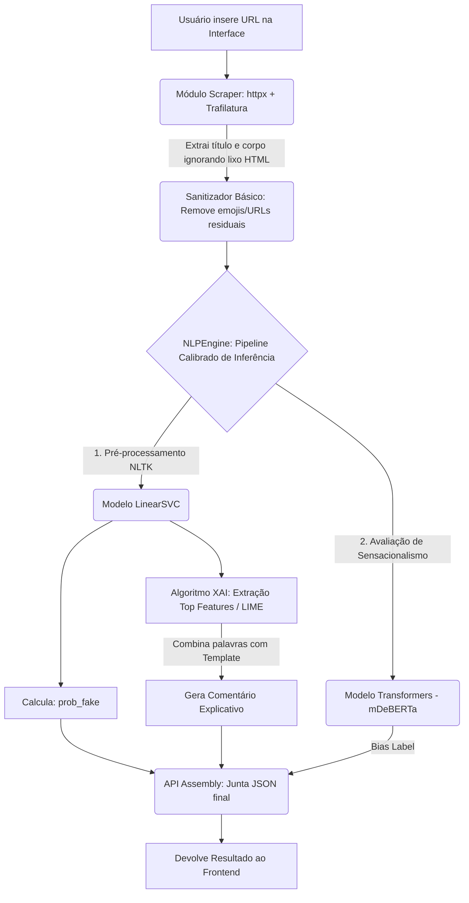

# Diagnóstico e Plano de Ação: Hub de Verificação de Notícias

Este documento apresenta a análise do modelo de Machine Learning atual para detecção de desinformação, os gargalos de inferência, e propõe uma estratégia sólida e viável de explicabilidade de IA (XAI) sem o uso de Grandes Modelos de Linguagem (LLMs).

---

## 1. DIAGNÓSTICO DO MODELO ATUAL

Após uma varredura minuciosa nos arquivos-fonte (em especial `ml/inference.py` e os notebooks de EDA e treinamento), foi mapeado o estado atual da solução:

*   **Arquitetura Atual (Ensemble/Híbrida):** 
    *   **Fake News (Score Factual):** Um classificador linear, especificamente o **LinearSVC** empacotado em um calibrador (`CalibratedClassifierCV` do scikit-learn), que se alimenta de representações estatísticas do texto usando o método **TF-IDF**. 
    *   **Análise de Viés:** Um modelo Transformer pré-treinado (`mDeBERTa-v3-base-mnli-xnli` da Hugging Face) executando predição de classe via Zero-Shot Classification.
*   **Pré-processamento de Texto:** A higienização para o modelo de base obedece uma rotina rigorosa (mapeada no `01_preproc_eda.ipynb`):
    *   Conversão integral de caracteres para minúsculas.
    *   Substituição de URLs pelo token reservado ` urltoken `.
    *   Remoção de números e caracteres especiais através de Expressões Regulares, preservando as letras e a acentuação em português (`[^a-zA-Záàâãéèêíïóôõöúçñ\s]`).
    *   Tokenização por espaços em branco, seguida de remoção de pontuação.
    *   Remoção de *stopwords* usando a biblioteca `NLTK` (`stopwords.words('portuguese')`).
    *   Descarte de tokens curtos (comprimento $\le 2$).
*   **Serialização e Exportação:** O modelo de classificação factual e o vetorizador TF-IDF *já estão exportados e consolidados*. Eles foram agrupados e calibrados no formato `.joblib`, e atualmente são instanciados pelo arquivo `models/calibrated_pipeline.joblib`. 
*   **Gargalos Atuais no Script de Inferência:**
    *   **Transformer e GPU/RAM:** A dependência no Hugging Face pipeline (`mDeBERTa`) para verificar o "Viés" exige download pesado na inicialização e o modelo tem limite de contexto rígido, o que forçou a equipe a fazer um hard-cut agressivo no texto (`text[:1500]`). Isso onera o uso de memória e eleva muito o tempo de inferência se estiver rodando isolado em servidores menores.
    *   **TF-IDF Vocabulary:** A inferência usando TF-IDF é extremamente rápida, no entanto, ela retém na memória todo o vocabulário do dataset de treinamento original, o que em alguns casos resulta em um binário consideravelmente grande.

---

## 2. ESTRATÉGIA DE EXPLICABILIDADE (SEM LLM)

Como a restrição crítica impede a adoção de um LLM corporativo na geração da narrativa de retorno, iremos extrair as decisões matemáticas diretamente da nossa camada nativa do classificador que julga se o texto é Falso. 

### Abordagem Matemática (Extração do LinearSVC + TF-IDF)

Por tratar-se de um SVM de kernel linear atrelado a TF-IDF, a superfície de decisão tem pesos linearmente aditivos: $f(x) = W \cdot X + b$.
Para explicar a "Nota" individual de um texto submetido por URL, utilizaremos o método de **Atribuição de Pesos de Coeficientes ou LIME/SHAP Linear:**
1. O texto inserido gera um vetor numérico exato na dimensão do TF-IDF.
2. Fazemos a multiplicação ponto a ponto (*element-wise*) ou produto escalar das frequências ($X$) daquele texto pelo vetor global de pesos do modelo treinado ($W$).
3. Os resultados mais positivos indicarão os exatos "tokens/palavras" do texto que puxaram a decisão fortemente para *FAKE NEWS*.

> *Se optarmos pela biblioteca **LIME** (TextExplainer), o cálculo é mascarado de forma probabilística, contudo, a abstração direta dos coeficientes na matriz é mais leve (O(1) extra) em produção.*

### Lógica de Tradução para o Usuário Final (Templates Fixos)

Extraímos as Top-3 a Top-5 palavras suspeitas e injetamos em pequenos *templates* dinâmicos condicionados à nota de saída (`prob_fake`):

*   **Faixa Crítica (prob_fake $\ge$ 70%):**
    *   *Comentário Fixo:* "Nossos algoritmos identificaram uma alta possibilidade de desinformação. A estrutura da redação usa linguagem de alerta e sensacionalismo comum em *fake news*. Os termos detectados que mais indicaram perigo na sua nota foram: **[{top_words}]**."
*   **Faixa de Dúvida (prob_fake entre 35% e 69%):**
    *   *Comentário Fixo:* "O texto analisado apresentou características mistas. Embora não haja certeza absoluta de inverdade, foram detectados indícios moderados de manipulação de linguagem, notadamente o uso de termos como **[{top_words}]**. Recomendamos verificar canais oficiais."
*   **Faixa de Confiança (prob_fake $<$ 35%):**
    *   *Comentário Fixo:* "A notícia analisada possui linguagem predominantemente descritiva e segura, sem sinais de alerta ou alarmismo. O modelo não identificou termos de manipulação estatisticamente relevantes, avaliando o texto como provável notícia real."

---

## 3. ARQUITETURA DE TRANSIÇÃO (O PIPELINE DA URL)

O fluxo síncrono para garantir a entrega da confiabilidade do começo ao fim (URL até Explicabilidade) deve seguir estes estágios:

### Componentes Chave da Transição
1.  **O Script de Extração:** A leitura via script continuará utilizando `httpx` para *requests* simulando o *User-Agent* do Chrome e depois injetará o HTML retornado no **`trafilatura.extract`**. Essa escolha atual já é excelente, pois o *trafilatura* elimina anúncios, barras laterais e popups automaticamente.
2.  **O XAI Interceptor:** Antes do endpoint retornar os valores, injetaremos um utilitário (ex: `ExplainabilityEngine`) responsável por processar o texto, multiplicar pelo `svc_model.coef_` isolado (ou acionar o `lime_text_explainer`) e retornar o *string* interpolado correspondente à predição.
